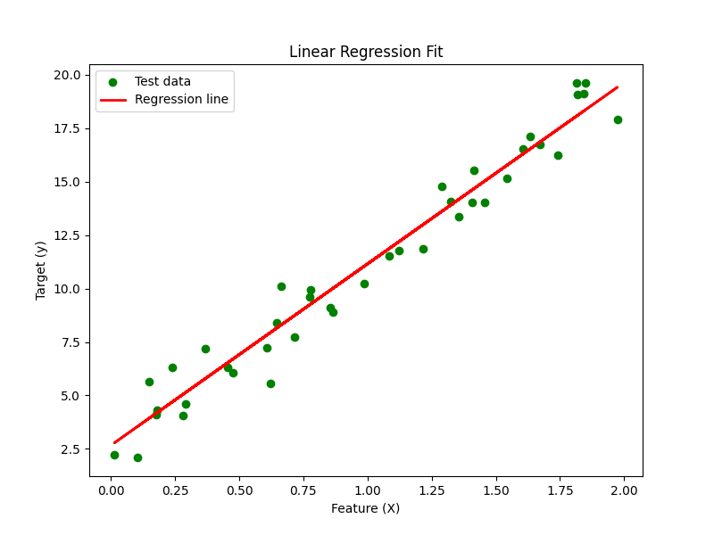

# Linear Regression from Scratch

A simple and educational implementation of a Linear Regression model in Python from scratch. This project provides a clear and concise example of how to build, train, and evaluate a linear regression model without relying on high-level machine learning libraries like Scikit-learn.



## 🚀 Features

-   **Pure Python Implementation:** The core linear regression model is built using only NumPy, making it easy to understand the underlying mechanics.
-   **Customizable Dataset:** Generate your own datasets with varying levels of noise and complexity using the `dataset_generator.py` module.
-   **Train-Test Split:** A custom implementation of train-test split is provided in `data_preprocessing.py`.
-   **Model Evaluation:** The model's performance is evaluated using the R-squared metric.
-   **Jupyter Notebook Demo:** A comprehensive `demo.ipynb` is included to provide a step-by-step guide on how to use the different modules.

## 🏁 Getting Started

These instructions will get you a copy of the project up and running on your local machine for development and testing purposes.

### Prerequisites

-   Python 3.x
-   pip

### Installation

1.  Clone the repository:
    ```sh
    git clone https://github.com/your-username/LinearRegression.git
    cd LinearRegression
    ```
2.  Install the required packages:
    ```sh
    pip install -r requirements.txt
    ```

## 🎈 Usage

The `main.py` file provides a quick way to see the model in action. To run it, simply execute:

```sh
python main.py
```

This will:
1.  Generate a synthetic dataset.
2.  Train the linear regression model.
3.  Evaluate the model's performance and print the R-squared score.
4.  Generate a plot of the regression fit and save it as `output.png`.

For a more detailed and interactive guide, check out the `demo.ipynb` Jupyter Notebook.

## 📂 Files in the Repository

-   `main.py`: The main script to run the linear regression model.
-   `linear_regression.py`: Contains the `LinearRegression` class.
-   `dataset_generator.py`: A module to generate synthetic datasets for regression tasks.
-   `data_preprocessing.py`: Includes functions for data splitting and evaluation metrics.
-   `demo.ipynb`: A Jupyter Notebook that provides a detailed walkthrough of the project.
-   `requirements.txt`: A list of required Python packages.
-   `output.png`: An example of the model's output plot.

## 🤝 Contributing

Contributions, issues, and feature requests are welcome!

## 📝 License

This project is licensed under the MIT License - see the [LICENSE.md](LICENSE.md) file for details.